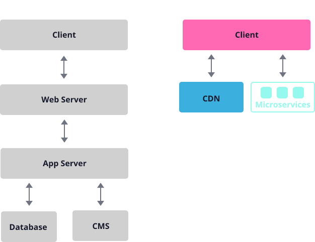

## 블로그를 만드는 이유

최근 바닐라 js로 SPA를 만들어보거나 리액트를 접해보면서 재미를 붙여 '나만의 사이트를 만들어보고 싶다'는 생각을 하게 됐다.

개인적 용도로 꾸준히 오랫동안 사용하면서 개선해나갈 사이트를 만들고 싶었고, 블로그가 그 목적에 가장 알맞다고 생각했다.

기존에는 티스토리 블로그를 사용(거의 안했지만..)했었기 때문에 블로그를 만들면서 다시 개발내용을 차근차근 기록해나가려고 한다.

## 왜 깃허브, Gatsby인가?

### Github Pages
평소에 다른 블로그들을 방문할 때 예쁜 테마로 디자인된 것을 보면 '어떻게 만들었지?' 하고 깃허브 저장소를 확인해보곤 한다. 
대부분 Gatsby, Jekyll, Hugo 등을 사용한 것을 보는데, 이들은 모두 `정적 사이트 생성기(Static Site Generator, SSG)`이다.

사용하는 언어는 각각 다르지만 `화면 구성 코드 -> 정적 사이트 생성 -> github pages로 호스팅`의 과정을 거쳐 블로그를 운영할 수 있다.

사이트 운영 방식으로는 물론 클라우드 서비스 등으로 서버를 띄워서 배포하는 방식도 있지만, 유지 비용이라는 큰 단점이 있다. 이밖에도 서버의 안정성, https와 보안 등 백/프론트 모두 신경써줘야 할 부분이 많다.
따라서 깃허브에서 제공하는 Github Pages 서비스를 사용해 정적 페이지를 호스팅하는 방식을 선택했다.

### JAM stack
위에서 말한 Gatsby, Jekyll, Hugo 등의 정적 사이트 생성기가 사용하는 방식을 `JAM(Javascript, API, Markup) stack`이라고도 한다.

> JAM stack은 웹 경험 레이어와 데이터/비즈니스 로직을 분리한 형태의 아키텍쳐 접근방식이다. - [jamstack 공식문서](https://jamstack.org/)

공식 홈페이지에서 말하듯 JAM 스택은 사용자에게 보여지는 정적인 리소스와 이외의 비즈니스 로직을 구분한 형태의 구조를 말한다. 
일반적인 웹서버/웹앱서버의 역할을 API 요청이라는 레이어 하나로 대체하는 것이다.

정적 페이지들을 미리 생성해놓기 때문에 페이지가 빨리 표시되어 사용자 경험 측면에서 유리하고, 깃허브 페이지 뿐만 아니라 어느 호스팅 서비스든 쉽게 사용할 수 있는 등의 장점이 있다.

이밖에 JAM stack에 대한 자세한 내용은 Gatsby에서도 제공한다. 
[What Is The Jamstack? - Gatsby](https://www.gatsbyjs.com/docs/glossary/jamstack/)

### Gatsby
Gatsby를 선택할 때 고려한 사항은 다음과 같다.

* 자바스크립트, 특히 리액트 기반으로 화면을 구성해보고 싶다.
* 블로그라는 목적에 적합해야 한다.

사실 리액트로 정적페이지를 다루는 다른 대표적인 방법으로 Next js가 존재한다.
Next js는 SSR 프레임워크이며 pre-rendering을 통해 SSG 또한 지원한다.
하지만 개인용 블로그라는 용도를 생각했을 때 사용자마다 보여주는 데이터가 다르지 않고, 데이터 변동이 필요없는 상황이기 때문에 정적 페이지만을 생성하는 Gatsby를 선택하기로 했다.

이어서...

## 참고
https://www.gatsbyjs.com/docs/glossary/jamstack/
https://azderica.github.io/00-web-jamstack/
https://velog.io/@longroadhome/FE-SSRServer-Side-Rendering-%EA%B7%B8%EB%A6%AC%EA%B3%A0-SSGStatic-Site-Generation-feat.-NEXT%EB%A5%BC-%EC%A4%91%EC%8B%AC%EC%9C%BC%EB%A1%9C

