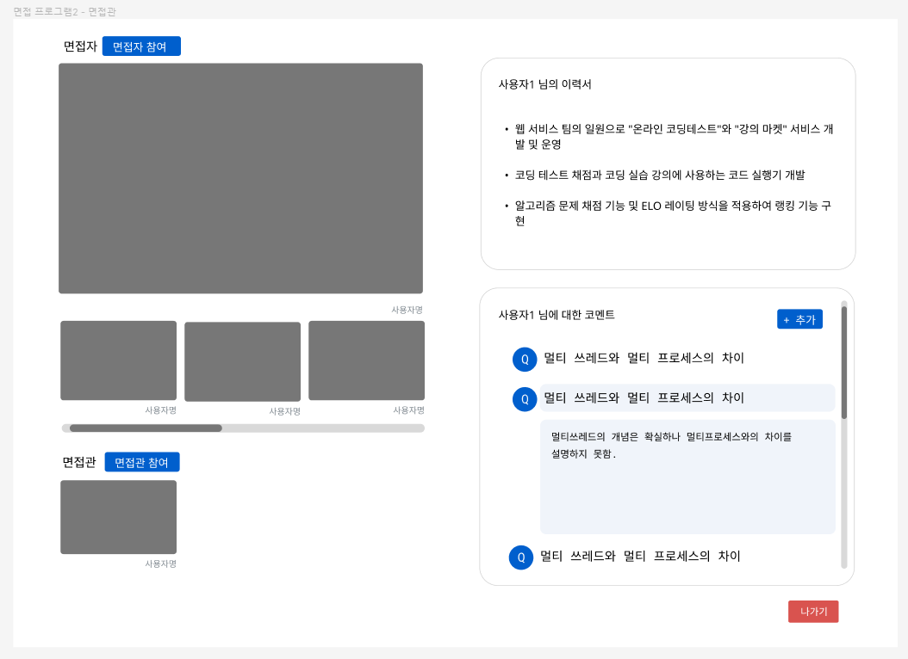
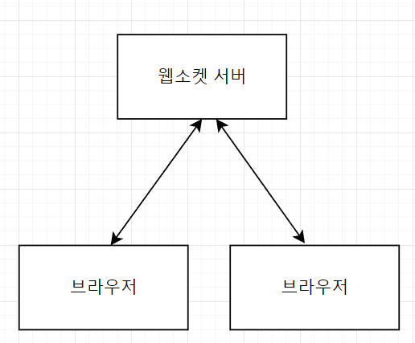
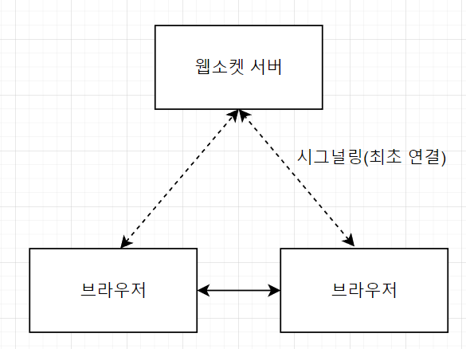
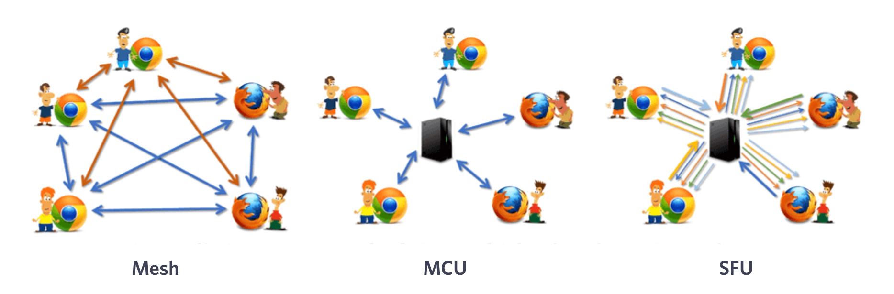
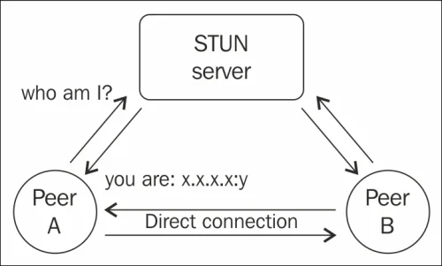
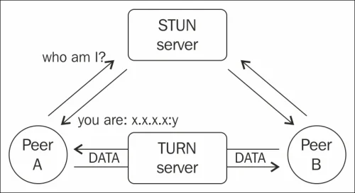
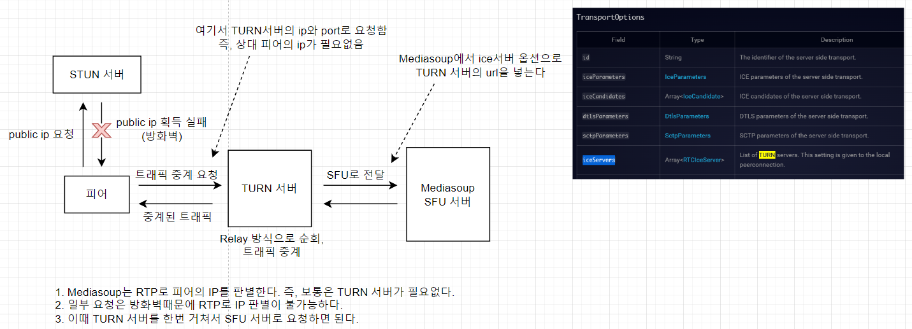
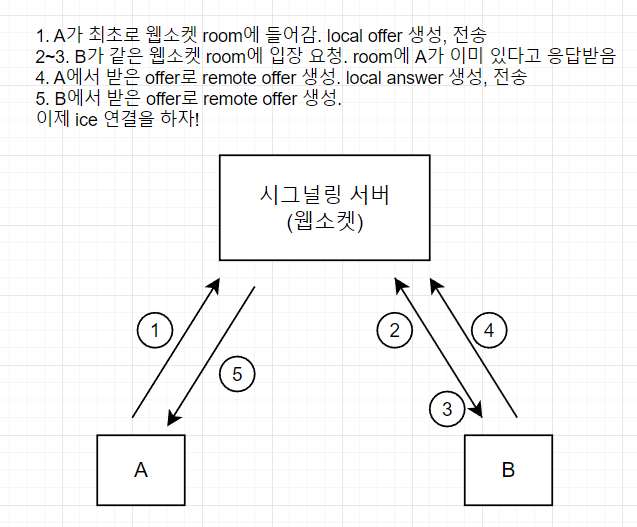
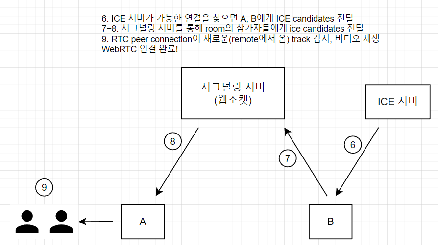

# WebRTC 맛보기
해당 글은 [MoMyeon 프로젝트](https://github.com/boostcampwm-2022/web23_MoMyeon) 진행 중 WebRTC에 대한 기본적인 개념을 공유하기 위해 작성한 글입니다.

## 1. 왜 WebRTC를 쓰나요?

### 온라인 모의면접 서비스, 모면!




- 웹에서 동작하는 면접 애플리케이션이 필요하다.
    - 즉, 영상과 음성을 클라이언트끼리 실시간으로 주고받아야한다.
    - 부캠타운에 사용했던 웹소켓으로도 가능하지 않을까?
        - 가능 하다! 하지만 미디어, 특히 영상/음성 통신에는 webRTC라는 api를 사용하면 더 높은 성능의 앱을 만들 수 있다.
    - webRTC만 있을까?
        - 세상은 넓고 프로토콜은 많다.. HLS, RTMP, RTSP, 등등..
        - HTTP 지원, HTML5 지원, 레퍼런스 문서 접근성, 오픈소스 여부 등을 따져봤을 때 webRTC가 가장 적절하다고 판단했다.
        

### 처음 접하는 기술을 학습하기

- WebRTC를 써야겠다.. 근데 이거 어떻게 쓰지? (아무도 모름)
    - 2주차는 팀원 모두가 학습에 집중하자!
    - 기존에 진행하던 프론트엔드 / 백엔드 개발은 잠시 일시정지 ⛔
    - 공식문서, 영상 강의, **멘토님(webRTC 고수)** 등등.. 자료를 공유하며 학습

## 2. WebRTC란?

> **WebRTC** (Web Real-Time Communication): 웹을 위한 실시간 커뮤니케이션 - [WebRTC](https://webrtc.org/)
> 

위키에서는 WebRTC를 **‘웹 브라우저끼리 실시간으로 통신할 수 있도록 설계된 API’** 라고 설명한다. 

여기서 중요한 부분은 **`웹 브라우저끼리`** 통신한다는 점이다. 

### 웹소켓 통신



- 브라우저의 영상/음성 데이터를 항상 웹소켓 서버를 거쳐 주고받는다.
- 레이턴시가 높다. TCP 프로토콜을 사용하므로 스트리밍에 상대적으로 부적합하다.

### WebRTC 통신(Mesh 방식 기준)



- 시그널링(브라우저끼리 최초 연결)은 웹소켓 서버로, 이후 영상/음성 데이터는 직접 주고받는다.
- 레이턴시가 낮다. 주로 UDP, *RTP 등의 실시간 통신 목적의 프로토콜을 사용한다.
- 브라우저의 부담이 상대적으로 크다. (연결 방식에 따라 다름)

> 💡 **RTP(Real Time Transport Protocol)**: UDP를 기반으로 하는 프로토콜. 인코딩/디코딩 정보, 패킷 손실 감지 등의 기능을 하며 UDP에 비해 성능이 높고 효율적이다.


### WebRTC를 사용하는 방법들

- WebRTC라고 검색하면 가장먼저 나오는 사진들..



- **Mesh:** 브라우저가 모든 부담을 가진다.
    - 위에서 설명한 브라우저 끼리 통신하는 경우에 해당

- **MCU (Multipoint Control Unit):** 중간에 있는 서버가 통신하는 브라우저의 데이터를 하나로 합쳐 전송한다.
    - `서버에서 합치는 비용이 크다.
    
- **SFU (Selective Forwarding Unit):** 중간에 있는 서버가 각 브라우저의 요청/응답 스트림을 라우팅한다.
    - Mesh에서 클라이언트의 부담을 서버로 일부 옮긴 방식.
    - 다수의 경우 여전히 브라우저의 부담이 크다.
    - zoom이 초기에 사용한 방식이지만, 현재는 webRTC의 일부와 웹어셈블리를 함께 쓰는 독자적인 방식을 사용한다.

## 3. 구현을 위해선 조금 더..

- 개념적인 부분은 이해된 것 같다. 근데 구현은 어떻게 시작하지?
- 위의 개념에 더해서 실제로 WebRTC를 사용하기 위해선 몇가지 개념을 더 알아야 한다.
- 용어들이 많다.. 무슨 역할인지만 간단하게 짚고 넘어가자

### STUN, TURN, ICE, 그리고 RTC PeerConnection

- 네트워크 방화벽 때문에 바로 직접적인 연결을 하기 어렵다.
- public IP를 알기 위해 STUN, TURN 서버를 추가적으로 사용해야 한다!

- ****STUN (Session Traversal Utilities for *NAT)****
    - 피어가 요청하면 피어의 public IP를 알려준다. 이후 webRTC 통신에선 관여하지 않는다.
    
    
    

> 💡 **NAT :** 외부 IP 요청이 라우터를 경유하도록 하는 기술, 방화벽 기능


- **TURN** (****Traversal Using Relays around NAT)****
    - *Symmetric NAT 환경에서 STUN만으로는 직접 연결이 어렵다. 이럴 때 사용된다.
        - 즉 STUN 서버 먼저 확인한 뒤, 연결이 안된다면 TURN서버를 사용하는 식
    - STUN과 마찬가지로 public IP를 알려주며, 이후 피어끼리 통신에도 중간에 관여하며 미디어 스트림을 중개하는 relay 방식으로 작동한다.
    
    
    

> 💡 **Symmetric NAT :** 외부에서 요청하는 서버마다 다른 포트를 매핑하는 NAT

- **ICE(Interactive Connectivity Establishment)**
    - STUN, TURN 서버를 이용해 통신이 가능한 경로를 찾아주는 프레임워크
    - ICE만으로는 public ip를 알지 못하고, ICE+STUN 서버, ICE+TURN 서버 등의 조합으로 사용한다.
    - 코드로 보면 이해가 쉽다. 이후 RTC PeerConnection을 생성할 때 옵션으로 사용된다.
    
    ```jsx
    const rtcConfig = {
      // ICE 서버의 설정. 내용으로 TURN, STUN 서버의 url이 들어간다.
      iceServers: [
        {
          urls: ['turn:turn-test.ml:3478?transport=tcp'],
          username: 'hello',
          credential: 'world',
        },
      ],
    };
    ```
    

- **RTC PeerConnection**
    - webRTC로 다른 피어와 연결할 수 있도록 해주는 인터페이스
    - 위의 ICE, TURN/STUN 서버 설정을 사용해 RTC PeerConnection 객체를 생성하고 이후 연결에 쓰인다.
    
    ```jsx
    const peerConnection = new RTCPeerConnection(rtcConfig);
    ```
    

## 4. 그래서 어떻게 쓰는데요?

- 이론의 향연.. 그래서 실제 코드는 어떻게 쓰나요?
- 1:1 화상채팅을 구현한 코드의 일부를 같이 확인해보자!
- 코드는 Mesh방식의 1:1 화상채팅을 구현한 것의 일부이다.
    - **다음 코드를 참고했습니다.**
    - https://github.com/jasonkang14/webrtc-web-one-to-one-client
- 2가지 단계로 나눠서 보자.
    - SDP 주고받기 ~ ICE 연결 이전
    - ICE 연결 ~ 연결 완료

### SDP 주고받기 ~ ICE 서버 연결 이전

- offer를 전송할때 프로토콜은 RTC SDP(Session Description Protocol)를 사용한다.



- local offer를 생성해서 시그널링 서버에 전송한다.

```jsx
const rtcConfig = {
  // ICE 서버의 설정. 내용으로 TURN, STUN 서버의 url이 들어간다.
  iceServers: [
    {
      urls: ['turn:turn-test.ml:3478?transport=tcp'],
      username: 'hello',
      credential: 'world',
    },
  ],
};
const peerConnection = new RTCPeerConnection(rtcConfig);

// pcRef는 RTC peer connection을 가리키는 useRef 객체이다.
const createNewOffer = async () => {
  // 생략..
  const newOffer = await pcRef.current.createOffer();
  await pcRef.current.setLocalDescription(newOffer);

  socketRef.current.emit('new-offer', {
    offer: newOffer,
    roomId: roomIdRef.current,
  });
};
```

- 참가자가 이미 있을 때 offer를 받아 remote offer생성하고 local answer를 생성, 전송한다.

```jsx
const handleRemoteOffer = async (offer) => {
    // 생략..

    const remoteOffer = new RTCSessionDescription(offer);
    await pcRef.current.setRemoteDescription(remoteOffer);

    const newAnswer = await pcRef.current.createAnswer(remoteOffer);
    await pcRef.current.setLocalDescription(newAnswer);

    socketRef.current.emit('new-answer', {
      answer: newAnswer,
      roomId: roomIdRef.current,
    });
  };
```

- remote offer 생성

```jsx
const handleRemoteAnswer = async (answer) => {
    const remoteAnswer = new RTCSessionDescription(answer);
    await pcRef.current.setRemoteDescription(remoteAnswer);
  };
```

### ICE 연결 ~ 연결 완료



- ice gathering이 완료되면 시그널링 서버로 알리고, 참가자들은 다시 서버로부터 알림을 받아 ice candidate를 추가한다.

```jsx
pcRef.current.addEventListener('icegatheringstatechange', () => {
      if (
        pcRef.current.signalingState === 'stable' &&
        pcRef.current.iceGatheringState === 'complete'
      ) {
        socketRef.current.emit('new-ice', {
          iceCandidates: iceCandidateRef.current,
          roomId: roomIdRef.current,
        });
      }
    });

//
socket.on('remote-ice', ({ iceCandidates }) => {
      iceCandidates.forEach((candidate) => {
        pcRef.current.addIceCandidate(candidate);
      });
    });
```

- track 이벤트를 감지하면 리모트의 영상을 틀어준다.
- **1:1 Mesh 연결 완료!**

```jsx
pcRef.current.addEventListener('track', (event) => {
      const [remoteStream] = event.streams;
      remoteVideoRef.current.srcObject = remoteStream;
 });
```

## 5. 모면 프로젝트에는 어떻게 쓰나요?



- Mesh 방식은 3~4명 이상이 연결되면 정상적인 통신이 힘들어진다고 한다.(수 년전 기준)
    - 우리 프로젝트는 최대 6명 기준으로 기획했다.
- 그래서 나온 대체방식이 위에서 소개한 MCU와 SFU.
    - MCU 방식은 서버의 부담이 너무 커질 우려가 있다고 생각했다. (서버에서 미디어 데이터를 합치는 데 들어가는 추가비용)
    - SFU 방식을 사용하자.
- SFU 서버로 사용할 오픈소스 라이브러리 비교: mediasoup vs janus-gateway
    - mediasoup는 node 패키지, janus는 기본적으로 c 기반이고 노드 패키지도 지원함
    - 팀원 모두가 js에 익숙함. mediasoup가 janus에 비해 최근 커뮤니티 글이 활발하고 참고자료가 이해하기 수월하다.
    - mediasoup로 결정, 필요 시 coturn(TURN 서버 오픈소스 라이브러리)으로 TURN 서버 구성

## 참고

**[How to set up and configure your own TURN server using Coturn](https://gabrieltanner.org/blog/turn-server/)**

[**video-streaming-protocol**](https://www.dacast.com/blog/video-streaming-protocol/)

[webrtc-web-client - jasonkang14](https://github.com/jasonkang14/webrtc-web-client)